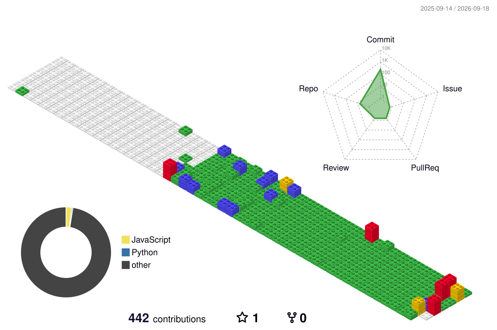

  

 
  <h2 style="border-bottom: 1px solid #d8dee4; color: #282d33;"> 📝 Introduction </h2> 
  

      저는 꾸준히 노력하는 개발자입니다 ✨ 
  
 

 

  <h2 style="border-bottom: 1px solid #d8dee4; color: #282d33;"> 🚀 Tech Stacks </h2>
  
 
    
    
    
    
    
    
    
    
     
    
    
    
    
    
         
  

 

  <h2 style="border-bottom: 1px solid #d8dee4; color: #282d33;"> 🛠️ Tools </h2>
    
  
 
    
    
    
    
     
    
    
    
    
  

 

  <h2 style="border-bottom: 1px solid #d8dee4; color: #282d33;"> ✅ Todo </h2>
    
  
 
    
    
    
  

 

  <h2 style="border-bottom: 1px solid #d8dee4; color: #282d33;"> 🏅 Certifications </h2>

  

    
  

   

  - `2024-04`: SQL 개발자 (SQLD) 취득
  - `2024-06` : 정보처리기사 취득
  - `2025.12` : AWS Certified Solutions Architect(SAA-C03) - Associate 취득
  

 

